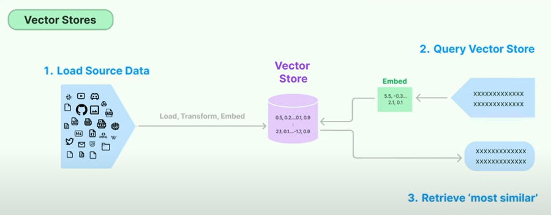

# RAG (Retrieval Augmented Generation) Pipeline
- I have built a RAG pipeline to showcase how we can augmentLLM knowledge with additional data.

## Visual Description of RAG Pipeline

## Description
- RAG is a technique for augmenting LLM knowledge with additional data.
- LLMs can reason about wide-ranging topics, but their knowledge is limited to the public data up to a specific point in time that they were trained on. 
- If you want to build AI applications that can reason about private data or data introduced after a model’s cutoff date, you need to augment the knowledge of the model with the specific information it needs. 
- The process of bringing the appropriate information and inserting it into the model prompt is known as Retrieval Augmented Generation (RAG).

## Libraries Used
- langchain==0.1.20
- langchain-community==0.0.38
- bs4==0.0.2
- pypdf==4.2.0
- chromadb==0.5.0

## Installation
 1. Prerequisites
    - Git
    - Command line familiarity
 2. Clone the Repository: `git clone https://github.com/NebeyouMusie/RAG-Pipeline.git`
 3. Create and Activate Virtual Environment (Recommended)
    - `python -m venv venv`
    - `source venv/bin/activate`
 4. Navigate to the projects directory `cd ./RAG-Pipeline` using your terminal
 5. Install Libraries: `pip install -r requirements.txt`
 6. Open and run all cells in the `rag_pipeline.ipynb` notebook
 7. Or you can download the documents in the `files` directory and the `rag_pipeline.ipynb`  Notebook from the `notebook` directory in the repository, upload those files and notebook to Google Collab then run all the cells in the `rag_pipeline.ipynb` Notebook